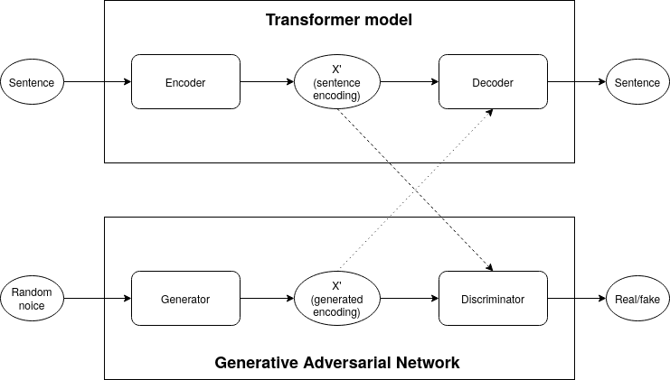

# Text generation with Transformer model and Generative Adversarial Network

## Project description

In recent years, Generative Adversarial Networks (GANs) have gained a lot of
traction in the Deep Learning community because of their impressive results in
image generation. The general idea is that a generator and a discriminator are 
jointly trained to produce an image output that is seemingly indistinguishable
from non-generated images.

We want to attempt to apply this strategy for text generation. The main
difficulty for this task is that whereas image outputs can be considered a
continuous value, a sentence is inherently discrete as it is a sequence of
words each of which is chosen by the model using the non-differentiable
$argmax$ function. To remedy this, we propose a model where the discriminator
is trained to distinguish between the continuous outputs of a pre-trained
encoder from a Transformer model given a 'true' sentence from the generated,
'fake' output stemming from our generator.

In our model, we will use a pre-trained Transformer (ie. by using BERT) that
can encode and decode a sentence from English to English. The encoded sentences
are then used as labelled training data for the discriminator, representing
'true' values. The job of the generator is to produce similar encodings but
doing this from random noise (a sample of words) in a way that makes the
discriminator unable to distinguish between the encodings stemming from the
encoder of the Transformer model and the encodings stemming from the generator.

Ideally, this would train the generator to produce sentence encodings that can
be fed to the decoder of the Transformer model which would then produce
meaningful sentences from this artificially generated input.

In our project, we want to explore and explain the theory of this model as well
as building a working prototype within the time and resource constraints that we
have. We do not assume any results and we are well prepared to discover, that
the model does not work as we intend. Furthermore, we want to analyze and
discuss the shortcomings of the model and present ideas for future fine-tuning
and other architectural improvements either to the model itself or to the
training process and data.
